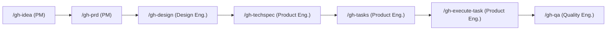

# GitHub-native Planning Workflow

This repo uses **GitHub Issues + the Project board** as the single source of truth
for product planning. No local planning files (no `.compozy/tasks`, no ad-hoc
markdown docs) are used — every idea, PRD, tech spec and task lives in a GitHub
issue, and its lifecycle is tracked on the project board.

- **Repo:** `diogogcunha/tictactoe`
- **Project:** `https://github.com/users/eduardosz98/projects/5` (owner: `eduardosz98`, number: `5`)
- **Project Status field options:** `Todo`, `In Progress`, `Done`

## Agents

Each stage of the pipeline is owned by a dedicated custom agent in
`.github/agents/` (`.agent.md` files). Prompt files declare `agent: <name>` in
their frontmatter so Copilot switches persona automatically when you run the
slash command.

| Agent | Agent file | Owns |
|---|---|---|
| **Product Manager** | `product-manager.agent.md` | `/gh-idea`, `/gh-prd` |
| **Design Engineer** (runs on Claude) | `design-engineer.agent.md` | `/gh-design` |
| **Product Engineer** | `product-engineer.agent.md` | `/gh-techspec`, `/gh-tasks`, `/gh-execute-task` |
| **Quality Engineer** | `quality-engineer.agent.md` | `/gh-qa` |

## Pipeline

1. **`/gh-idea`** (Product Manager) — Creates a new issue titled
   `[Idea] <title>`, adds it to the project with Status = `Todo`. This issue
   number becomes the anchor for everything that follows.
2. **`/gh-prd`** (Product Manager) — Given an idea issue number, rewrites that
   same issue's body into a full PRD and retitles it `[PRD] <title>`. No new
   issue is created — the idea issue *becomes* the PRD issue.
3. **`/gh-design`** (Design Engineer, Claude) — Given a PRD issue number, adds
   a `## Design` section to that same issue (layout, component breakdown,
   states, responsive behavior, Mermaid component tree) and a real static
   HTML/CSS prototype under `design/<n>-<slug>.html`.
4. **`/gh-techspec`** (Product Engineer) — Given a PRD+design issue number,
   appends a `## Technical Specification` section to that same issue body.
5. **`/gh-tasks`** (Product Engineer) — Given a PRD/tech-spec issue number
   (the "epic"), creates one `[Task] <title>` issue per implementable unit of
   work, each with `Parent: #<epic>` in its body, added to the project with
   Status = `Todo`. Posts a checklist comment on the epic issue linking every
   task.
6. **`/gh-execute-task`** (Product Engineer) — Given a task issue number, reads
   that issue (and its parent epic issue) for context, implements the change,
   opens a PR with `Closes #<task>`, and moves the task's project item to
   `In Progress`. Does **not** mark it `Done`.
7. **`/gh-qa`** (Quality Engineer) — Given a task issue number, checks out the
   PR, runs lint/tests/build, verifies every acceptance criterion from the
   epic independently, reviews the PR (approve or request changes), and only
   then moves the project item to `Done`.

## Conventions

- **Title prefixes** identify the issue's stage: `[Idea]`, `[PRD]`, `[Task]`.
  (Custom labels aren't used because this account only has read access to the
  repo's label list; rely on title prefixes and the `Parent: #N` reference
  instead.)
- **`Parent: #N`** in an issue body is the only parent/child link mechanism —
  GitHub auto-links it, and it's how `/gh-execute-task` finds the epic for
  context.
- Every issue that represents active planning/work must be an item on project
  `5` with a `Status`. Never track status in a separate file.
- Design prototypes are real files under `design/<epic-number>-<slug>.html`
  (static Tailwind-via-CDN HTML) — the only artifact allowed to live outside
  an issue body, since it must be openable in a browser.
- `Status` transitions are owned per agent: PM/Design/Product Eng. keep items
  in `Todo`; `/gh-execute-task` moves a task to `In Progress`; only `/gh-qa`
  moves it to `Done`.
- To auto-close the loop, enable the project's built-in **"Item closed"**
  workflow (Project → ⋯ → Workflows) so merged/closed issues move to `Done`
  automatically — `/gh-qa` still sets it explicitly as a safety net.
